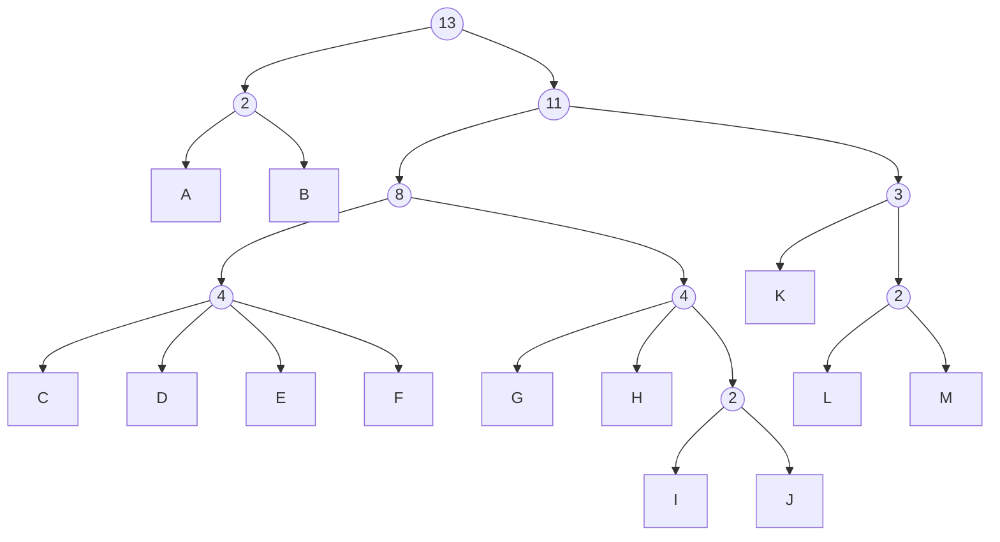

When you pick `J`, the chances are:
* 2/13 that 2 remain (`A`, `B`)
* 3/13 that 3 remain (`K`, `L`, `M`)
* 4/13 that 4 remain (`C`, `D`, `E`, `F`)
* 2/13 that 2 remain (`G`, `H`)
* 1/13 that 1 remains (`I`)
* 1/13 that 0 remain (`J`)

When you pick `B`, the chances are:
* 1/13 that 1 remains (`A`)
* 11/13 that 11 remains (`C`, `D`, `E`, `F`, `G`, `H`, `I`, `J`, `K`, `L`, `M`)
* 1/13 that 0 remains (`B`)

When you pick `C` the chances are:
* 3/13 that 3 remain (`D`, `E`, `F`)
* 1/13 that 0 remain (`C`)
* 4/13 that 4 remain (`G`, `H`, `I`, `J`)
* 3/13 that 3 remain (`K`, `L`, `M`)
* 2/13 that 2 remain (`A`, `B`)