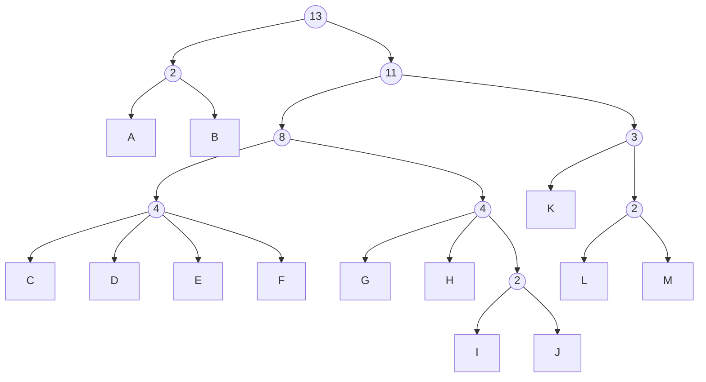

# Examples of what happens after 1 guess

## Pick `J`

When you pick `J`, the chances are:
* 2/13 that 2 remain (`A`, `B`)
* 3/13 that 3 remain (`K`, `L`, `M`)
* 4/13 that 4 remain (`C`, `D`, `E`, `F`)
* 2/13 that 2 remain (`G`, `H`)
* 1/13 that 1 remains (`I`)
* 1/13 that 0 remain (`J`)

# Pick `B`

When you pick `B`, the chances are:
* 1/13 that 1 remains (`A`)
* 11/13 that 11 remains (`C`, `D`, `E`, `F`, `G`, `H`, `I`, `J`, `K`, `L`, `M`)
* 1/13 that 0 remains (`B`)

# Pick `C`

When you pick `C` the chances are:
* 3/13 that 3 remain (`D`, `E`, `F`)
* 1/13 that 0 remain (`C`)
* 4/13 that 4 remain (`G`, `H`, `I`, `J`)
* 3/13 that 3 remain (`K`, `L`, `M`)
* 2/13 that 2 remain (`A`, `B`)

# Examples of what happens after 2 guesses

Consider first guess is J

* In the 2/13 case that 2 remain (`A`, `B`) and you guess `A`
  * 2/13 * 1/2 that 1 remains (`B`)
  * 2/13 * 1/2 that 0 remain (`A`)
* In the 3/13 case that 3 remain (`K`, `L`, `M`) and you guess `L`
  * 3/13 * 1/3 that 1 remains (`M`)
  * 3/13 * 1/3 that 1 remains (`K`)
  * 3/13 * 1/3 that 0 remain (`L`)
* In the 4/13 case that 4 remain (`C`, `D`, `E`, `F`) and you guess `C`
  * 4/13 * 3/4 that 3 remain (`D`, `E`, `F`)
  * 4/13 * 1/4 that 0 remain (`C`)
* In the 2/13 case that 2 remain (`G`, `H`) and you guess `G`
  * 2/13 * 1/2 that 1 remains (`H`)
  * 2/13 * 1/2 that 0 remain (`G`)
* In the 1/13 case that 1 remains (`I`) and you guess `I`
  * 1/13 * 1 that 0 remain (`I`)
* 1/13 that 0 remain (`J`)
  * 1/13 * 1 that 0 remain (`J`)

